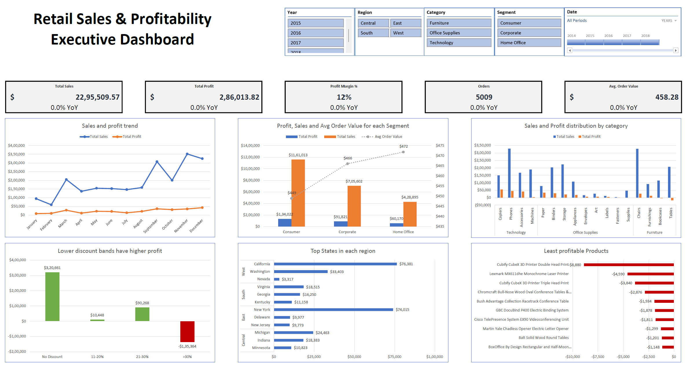
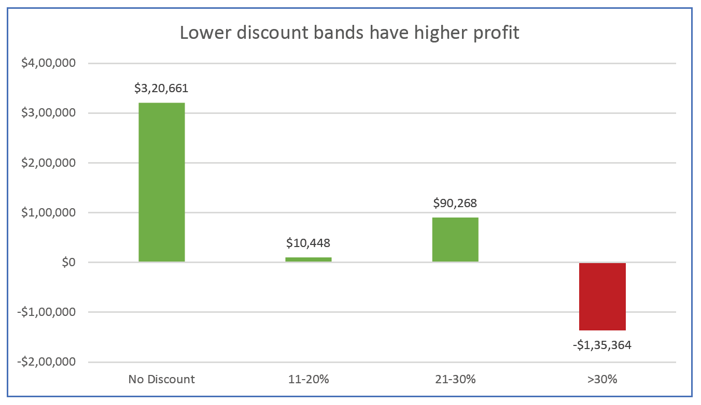
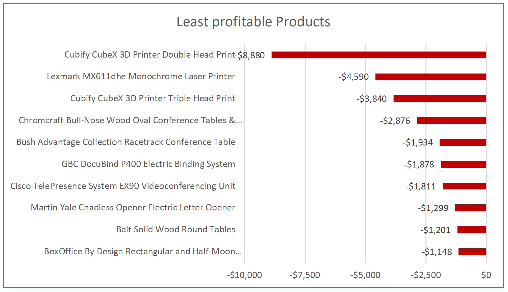
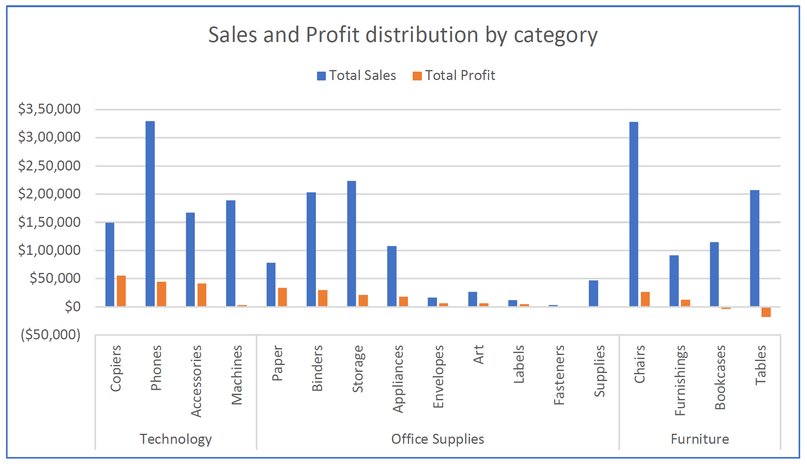
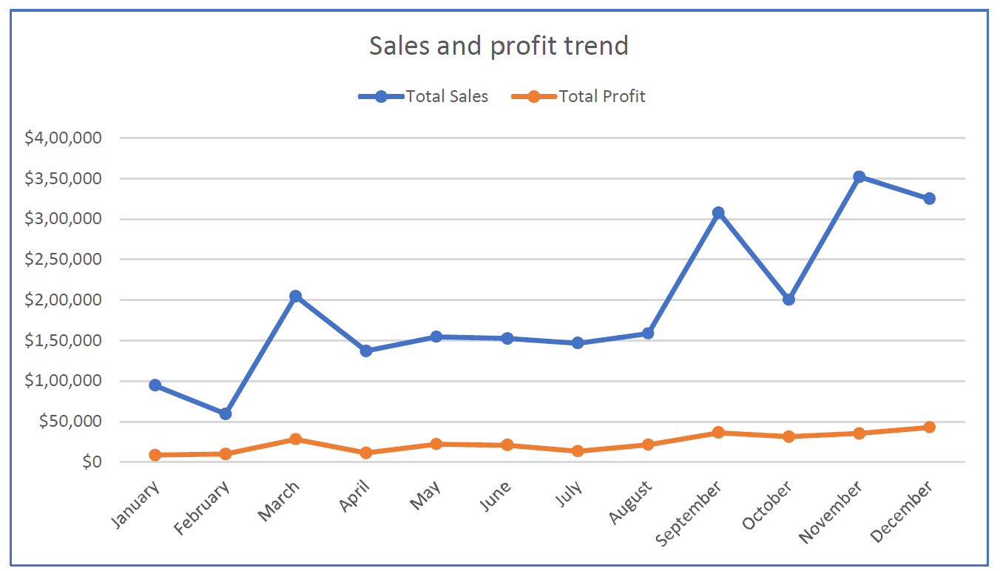
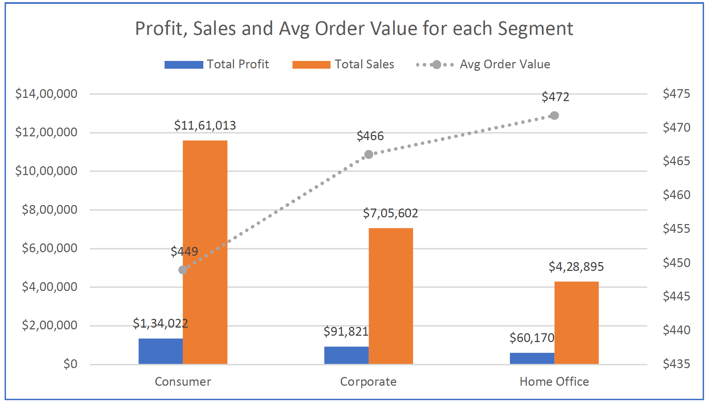
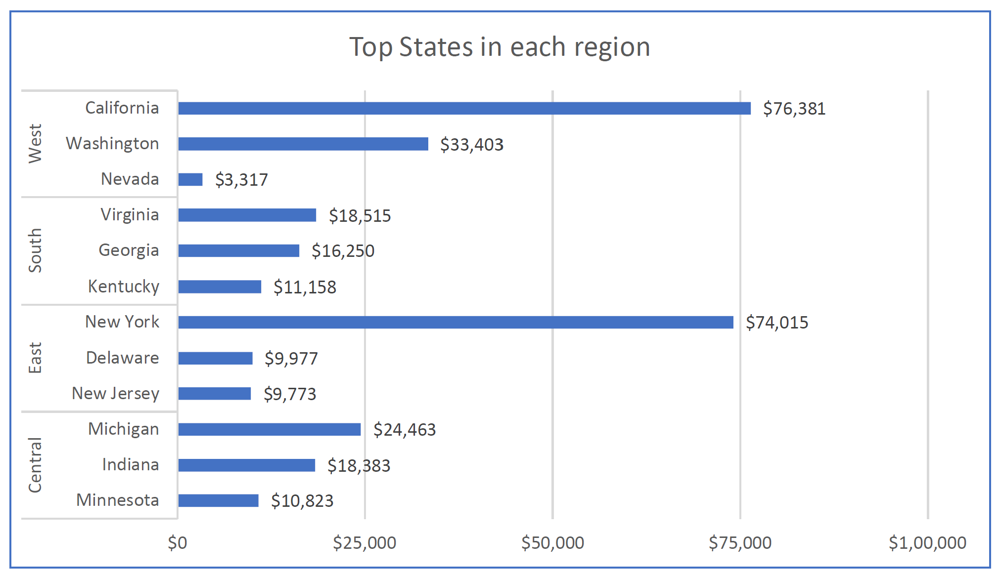

# Retail Sales & Profitability Executive Dashboard

An interactive, single-screen Excel Executive Dashboard built using Power Pivot, DAX, and Data Modeling to analyze sales performance, identify margin erosion drivers, and provide strategic profitability recommendations for retail leadership.

## 1. Business Problem

Superstore experiences strong top-line sales growth across multiple regions and product categories, but overall net profitability continues to lag expectations. Executive leadership lacks centralized visibility into which products, geographic regions, discounting policies, and seasonal cycles drive sustainable margins versus those silently eroding bottom-line profit. This project delivers an interactive, executive-ready dashboard that isolates loss drivers, evaluates Year-over-Year (YoY) performance metrics, and equips decision-makers with actionable strategic recommendations.

## 2. Dataset

* **Dataset Name:** Sample - Superstore Dataset

* **Source / Link:** [Kaggle - Sample Superstore Dataset](https://www.kaggle.com/datasets/naveenkumar20bps1137/sample-superstore/data)

* **Data Size:** 9,994 transactional records across 21 attributes

* **Time Period:** January 1, 2014 – December 31, 2017

## 3. Approach

* **Data Cleaning & Transformation:** Cleaned raw data fields, standardized data types, validated order date formatting, removed duplicates, and generated a contiguous calendar table (`Calendar`) for time intelligence calculations.

* **Data Modeling & DAX Measures:** Established 1-to-Many relationships between transaction data and the calendar dimension table in Power Pivot. Wrote custom DAX measures for core KPIs (`Total Sales`, `Total Profit`, `Profit Margin %`, `Orders`, `AOV`) and time intelligence YoY variance calculations (`DATEADD`, `SELECTEDVALUE`, `DIVIDE`).

* **Dashboard Design & UX:** Formatted a single-screen executive grid equipped with custom-styled KPI cards, 5 cross-filtered PivotCharts, and top-aligned floating slicers. Applied custom number formatting (`[Color10]` green and `[Red]`) for variance indicators.

* **Workbook Architecture & Security:** Set up report connections across all PivotTables, unlocked slicer objects, protected dashboard layouts, and secured workbook structure to prevent unauthorized backend modifications.

## 4. Key Findings

1. **Uncontrolled Discounting Erodes Margins:** Transactions with discounts under 20% generate strong net returns (`No Discount` profit: **\$320,661**), but deep discounts exceeding 30% collapse profitability into a total net loss of **-\$135,364**.

2. **High Sales, Loss-Leading Sub-Categories & SKUs:** High-revenue sub-categories like **Tables** (-\$17,725 net profit) and **Bookcases** (-\$3,473 net profit) operate at a net loss, while individual hardware items like the **Cubify CubeX 3D Printer** account for **-\$8,880** in losses.

3. **Severe Regional Margin Disparities:** High-volume states such as **Texas** (-\$25,729 loss), **Ohio** (-\$16,971 loss), **Pennsylvania** (-\$15,559 loss), and **Illinois** (-\$12,618 loss) drive substantial top-line revenue but destroy net operating value due to aggressive regional discounting.

4. **Heavy Q4 Demand Concentration:** Revenue follows strong seasonality, building steadily throughout Q1–Q3 before surging in **Q4 (September–December)**. November represents the annual revenue peak (over **\$350,000**), whereas January and February experience steep demand drops (\~\$100,000).

5. **Customer Segment Efficiency:** The **Consumer** segment contributes the highest absolute revenue (**\$1,161,013**) and profit (**\$134,022**), but the **Home Office** segment delivers higher transaction efficiency with a **\$501 Average Order Value (AOV)** (vs. \$379 Consumer) and \~14% profit margins.

## 5. Recommendations

1. **Enforce Strict Discount Caps:** Implement a firm **20% maximum promotional discount cap**, require Regional Vice President approval for discounts between 20%–30%, and completely prohibit discounts above 30%.

2. **Restructure Bulky Item Pricing & Rationalize SKUs:** Increase baseline prices and pass direct freight/shipping surcharges to customers on heavy furniture (Tables and Bookcases); delist or renegotiate supplier pricing for top loss-making tech SKUs.

3. **Establish Regional Price Floors:** Eliminate local promotional price-matching overrides in high-loss states (Texas, Ohio, Pennsylvania, Illinois) to protect net operating margins.

4. **Capitalize on Q4 Seasonality & Upsell High-AOV Segments:** Align inventory procurement and warehouse staffing for August/September ahead of Q4 peaks, while shifting marketing investments toward high-AOV **Home Office** corporate bundles.

## 6. Screenshots

### Executive Dashboard Overview

*Figure 1: Single-screen interactive Excel Executive Dashboard showing top KPI cards, interactive slicer banner, and cross-filtered charts.*

### Discount vs Profitability Analysis

*Figure 2: Discount band analysis illustrating margin collapse beyond the 30% discount threshold.*

## 7. How to Use the Workbook

1. **Open File:** Download and open `Superstore_Executive_Dashboard.xlsx` in Microsoft Excel (Excel 2016 or newer recommended for Power Pivot support).

2. **Interact with Filters:** Use the top slicer banner (**Year**, **Region**, **Category**, **Segment**, **Date**) on the `Dashboard` sheet to dynamically filter all KPI cards and charts simultaneously.

3. **Explore Insights:** Navigate to the `Insights` tab to review detailed business observations (*What We See, Why It Matters, What To Do*) along with embedded chart visuals.

4. **Inspect Documentation:** View the `README` tab within the workbook for sheet structure descriptions and user guidance.

5. **Data Protection:** The dashboard layout and worksheets are protected against accidental layout shifting. Slicers remain fully enabled for interactive filtering.

## 8. Tools and Skills Used

* **Primary Tool:** Microsoft Excel

* **Data Modeling & BI:** Power Pivot, Data Model Relationships, Calendar Dimension Tables

* **Calculations & DAX:** DAX Measures (`CALENDARAUTO`, `DATEADD`, `SAMEPERIODLASTYEAR`, `SELECTEDVALUE`, `DIVIDE`, `CALCULATE`)

* **Data Visualization & UX:** PivotCharts, Custom Number Formatting (`[Color10]` Green / `[Red]`), Layout Alignment, Card Formatting

* **Workbook Engineering:** Slicer Connections (Report Connections), Sheet & Workbook Protection, Data Security Setup

## 9. Sample Charts

